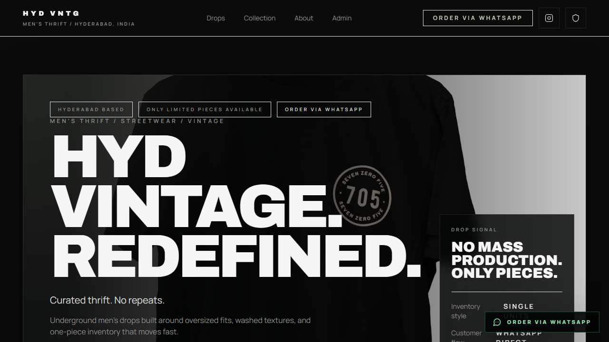

# HYD VNTG Storefront

> **Status: MVP / Public Canonical Candidate** — The storefront build passes. This public repository is the recommended recruiter-facing canonical copy after its release PR and rename are complete.

[](docs/demo/demo.webm)

HYD VNTG is a responsive men's thrift and streetwear storefront for Hyderabad with public product browsing, a WhatsApp handoff, local catalog fallback, and optional Supabase-backed inventory administration.

## What works today

- Responsive catalog and collection browsing
- Product detail and order-handoff workflow
- Local browser inventory fallback for demonstration
- Optional Supabase product and authentication integration
- Static Vercel/Netlify deployment configuration

The video demonstrates browsing and the handoff form without sending a real message. Admin access is disabled unless Supabase or explicit local demo credentials are configured.

## Stack

- React 19 and Vite
- Tailwind CSS
- Supabase JS (optional)
- Local storage fallback

## Run locally

```bash
git clone https://github.com/badugujashwanth-create/hyd-vntg-storefront.git
cd hyd-vntg-storefront
npm ci
npm run dev
```

## Build and verification

```bash
npm run build
npm audit --omit=dev
```

See [docs/TEST_REPORT.md](docs/TEST_REPORT.md) for the last verified environment and [docs/demo/DEMO_SCRIPT.md](docs/demo/DEMO_SCRIPT.md) for the demonstration boundary.

## Environment

Copy `.env.example` to `.env` and provide only the integrations you intend to use.

| Variable | Purpose |
|---|---|
| `VITE_WHATSAPP_NUMBER` | Order-handoff destination; visible in the browser bundle |
| `VITE_SUPABASE_URL` | Optional Supabase project URL |
| `VITE_SUPABASE_ANON_KEY` | Optional public Supabase client key; database rules remain essential |
| `VITE_ADMIN_EMAIL` | Optional local-demo admin identity when Supabase is absent |
| `VITE_ADMIN_PASSWORD` | Optional local-demo password; never reuse a real password |

No local admin credential is built into the application. Without Supabase or both explicit demo-admin values, the admin login fails closed.

## Deployment and security boundaries

- Vercel and Netlify SPA rewrites are included.
- The public catalog can run without a backend.
- Supabase policies in `supabase/schema.sql` must be reviewed before connecting real inventory.
- `VITE_*` values are public browser configuration; never place a service-role key or private secret in them.
- WhatsApp handoff leaves the application and must be reviewed before using a real business number.

## Repository relationship

The application source began as a content-identical public/private duplicate. This public copy is being promoted as the recruiter-facing canonical repository so portfolio links never require authentication. The private duplicate is not deleted or archived by this release.

## License status

No license file is currently present. All rights remain with the copyright holder unless an ownership-informed license is added manually.
