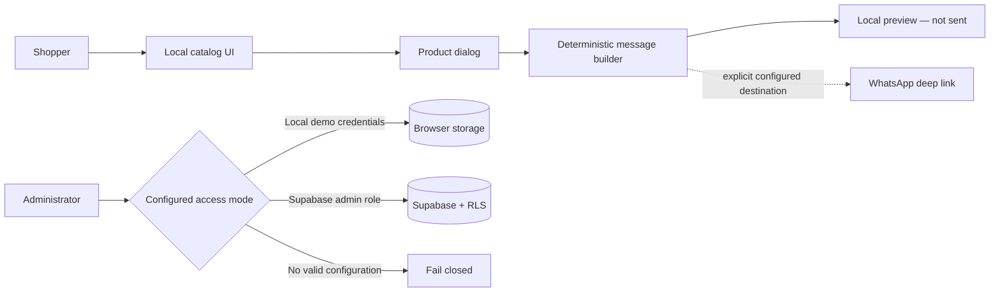

# HYD VNTG architecture

The public canonical product is a React/Vite client that runs a complete synthetic catalog and order-preview workflow without credentials or external services.

## System view

## Core boundaries

- `data/catalog.js` owns synthetic product fixtures and local asset paths.
- `lib/whatsapp.js` validates the optional destination, builds a deterministic message, and returns without opening a window when configuration is invalid.
- `ProductModal.jsx` uses a labeled modal, focuses its close control, supports Escape, validates phone digits, and shows the complete message locally when handoff is disabled.
- `lib/product-store.js` normalizes/recover catalog storage and separates three admin modes: disabled, browser-only local demo, and Supabase.
- `supabase/schema.sql` allows public product reads but requires a server-assigned `app_metadata.role = admin` for insert, update, and delete.

## Failure behavior

- Missing WhatsApp or Instagram configuration is visible and produces no placeholder navigation.
- Missing local admin credentials clear stale local sessions and reject login.
- A Supabase session without the server-side admin role is signed out and rejected.
- Failed Supabase mutations surface an error and never silently fall back to local writes.
- Failed public Supabase reads may show the synthetic local catalog with a visible notice; that does not imply live inventory.

## Unsupported paths

Payment, checkout, inventory reservation, customer accounts, fulfillment, production analytics, provider ownership, and deployed Supabase policies are outside the release claim. The private duplicate is preserved but not part of the runtime or portfolio entry.
